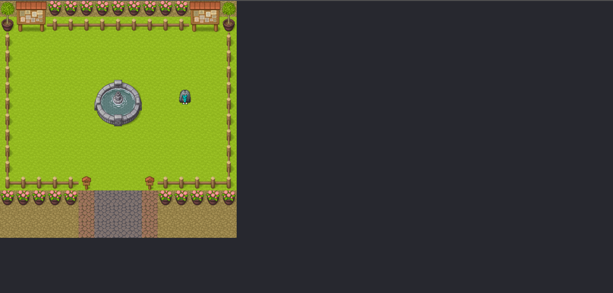

# Primeiro Jogo RPG feito em React: :books:

O quarto projeto dessa maratona (5em5) de projetos é modelar um simples joguinho de RPG usando todo o poder do react. A imagem a baixo ilustra a arte do projeto:

## A dinâmica seguiu os seguintes tópicos:

* O mapa está contido em um plano de fundo como div.

* Além disso, possui um arquivo mapSpots.ts que mapeia as regiões que o personagem pode se mover livremente.

* O personagem é modelado pelo componente Character.ts. A imagem do personagem está no arquivo char.png.

* A mudança de posição e movimento do personagem ao redor do mapa é modelada pelo arquivo useCharacter.ts.
Este gancho personalizado foi modelado para estudar esse padrão arquitetônico.

* useCharacter.ts contém alguns recursos:
       * [] moveDown, moveUp, moveLeft, moveRight são responsáveis pelo movimento do personagem.
       * [] side controla a posição do personagem
       * [] x e y é a posição de um personagem em relação ao mapa criado.

## Extra:

O projeto foi desenvolvido em React Js, dessa forma toda sua estrutura é baseada no conceito de componentização e divisão dos serviços. Outro ponto importante é a utilização de hooks personalizados, onde crio o meu proprio expesifico para o projeto.

=> Para ver o funcionamento é necessario fazer um clone desse projeto.
